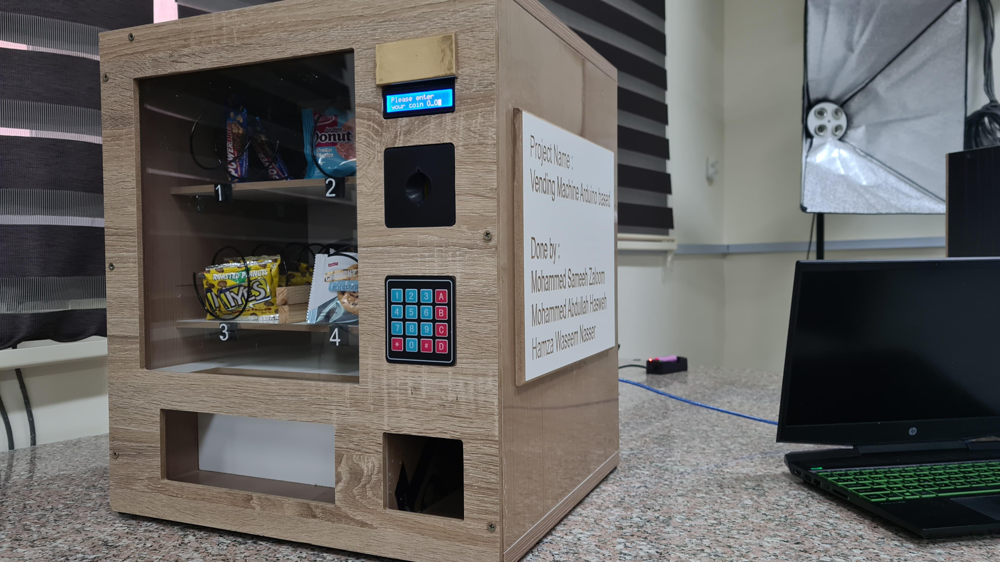

# Arduino-Based Vending Machine

A compact, Arduino-powered vending machine prototype developed as an Embedded Systems project at Al‑Balqa' Applied University.

<p align="center">
  
</p>

---

## Overview

This repository contains all resources for a prototype vending machine, including hardware designs, firmware, documentation, and media. The system demonstrates a complete vending workflow, from coin validation to product dispensing.

---

## Features

- **Coin Validation:** Accepts and verifies coins using a load-cell and IR sensors.
- **User Interface:** 4×4 keypad for item selection and a 16×2 I²C LCD for prompts and status.
- **Product Dispensing:** Servo-driven mechanism for reliable item delivery.
- **Custom Enclosure:** Combination of wood and 3D-printed parts for structure and mounts.

---

## Repository Structure

```
.
├── LICENSE
├── README.md
├── circuit
│   └── vending Machine Diagram.fzz
├── code
│   └── Vending_Machine_Final.ino
├── images
│   ├── vm-0.png
│   ├── vm-1.jpg
│   ├── vm-2.jpeg
│   ├── vm-3.jpeg
│   ├── vm-4.jpeg
│   ├── vm-5.jpeg
│   ├── vm-6.jpeg
│   ├── vm-7.jpeg
│   ├── vm-8.jpeg
│   └── vm-9.jpeg
├── presentation
│   └── VM2.pptx
└── videos
    └── vm-0.mp4
```

---

## Hardware Components

| Component               | Qty | Description                                  |
|-------------------------|:---:|----------------------------------------------|
| Arduino Mega 2560       |  1  | Main microcontroller                         |
| Servo motors            |  4  | Item dispensing                              |
| Load-cell + HX711       |  1  | Coin weight measurement                      |
| IR obstacle sensors     |  3  | Coin speed and diameter detection            |
| 4×4 Keypad              |  1  | User input                                   |
| 16×2 LCD (I²C)          |  1  | Display                                      |
| Wood panels & fasteners | —   | Enclosure                                    |
| 3D-printed parts        | —   | Coin slot, mounts, decorative elements       |
| Wiring, resistors, breadboard | — | Circuit interconnects                    |

---

## Installation & Setup

1. **Clone the repository**
   ```bash
   git clone https://github.com/your-username/vending-machine-arduino-based.git
   cd vending-machine-arduino-based
   ```

2. **Assemble the hardware**
   - Follow the Fritzing diagram in `circuit/vending Machine Diagram.fzz`.
   - Mount sensors, servo motors, keypad, and LCD into the wooden frame.
   - Wire all components to the Arduino Mega as shown in the documentation (pp. 8–12).

3. **Upload the firmware**
   - Open `code/Vending_Machine_Final.ino` in the Arduino IDE.
   - Select “Arduino Mega 2560” and the correct COM port.
   - Install required libraries:
     - `LiquidCrystal_I2C`
     - `Keypad`
     - `HX711`
   - Upload the code to the board.

4. **Power and test**
   - Supply 5 V to the Arduino (USB or external).
   - Insert coins and use the keypad to select items.
   - Verify LCD prompts and servo operation.

---

## Usage

1. **Startup:** LCD displays a welcome message and item list.
2. **Insert Coin:** Machine measures coin; LCD shows accepted value.
3. **Select Item:** Enter item code (e.g., `A1`) on the keypad.
4. **Dispense:** Servo delivers the item; LCD thanks the user and resets.

---

## Project Timeline

- **Nov–Dec 2023:** Design, hardware integration, coin detection
- **Jan 2024:** Firmware development, testing, presentation
- **Jan 2 2024:** Final demonstration and report submission

---

## License

This project is released under the [MIT License](LICENSE).
